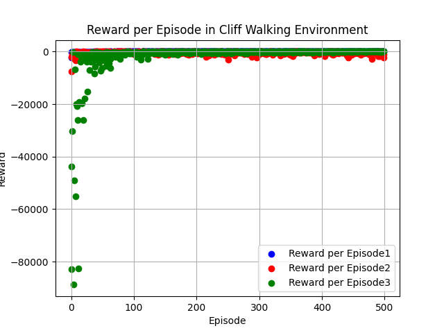

# Week 1 Submission - Lokik Agarwal (250609)

## Task 1 - Formulating your world as MDP

Refer to Week_1___assignment_1___part_1.pdf for the complete MDP formulation and manual Value Iteration calculations.

### Summary
- **Scenario:** Morning decision — Wake up, Go for bath, or Sleep 30 more minutes
- **State Space:** S0 = Wake up (initial), S1 = Go for bath (terminal), S2 = Sleep 30 more minutes (terminal)
- **Action Space:** A1 = Bath, A2 = Sleep
- **Rewards:** +10 for transitioning to S1, +5 for transitioning to S2

### Value Iteration (2 steps, γ = 0.9)
- If action = A1 (bath): **V2(S0) = 9**
- If action = A2 (sleep): **V2(S0) = 5.5**
- Optimal policy maps S0 → S1 via action A1 with value **9**

---

## Task 2 - The Epsilon Decay Challenge

### Environment
CliffWalking-v0 (Gymnasium)

### Hyperparameters
| Parameter | Value |
|-----------|-------|
| Alpha (learning rate) | 0.1 |
| Gamma (discount factor) | 0.99 |
| Episodes | 500 |
| Epsilon 1 (constant low) | 0.05 |
| Epsilon 2 (constant high) | 0.5 |
| Epsilon 3 (decaying) | 1.0 → 0.01 (decay rate: 0.995) |

### Analysis

**Agent 1 - Constant Low Exploration (ε = 0.05):**
Exploits heavily from the start. Converges quickly to a policy but may get stuck in a suboptimal path since it rarely explores new routes.

**Agent 2 - Constant High Exploration (ε = 0.5):**
Explores more randomly throughout training. Takes longer to converge and has more variance in rewards, but has a better chance of finding safer paths.

**Agent 3 - Decaying Epsilon (ε: 1.0 → 0.01):**
Starts with full exploration and gradually shifts to exploitation. This agent balances exploration and exploitation most effectively — it explores widely in early episodes and then commits to the best path found, leading to the most stable and optimal convergence.

### Plot

From the graph:
- **Blue (ε=0.05):** Quickly stabilizes near 0 reward, indicating a safe but conservative path
- **Red (ε=0.5):** Shows more scattered rewards due to constant high exploration
- **Green (decaying ε):** Initially has very low rewards (exploring) but stabilizes over time as epsilon decays
