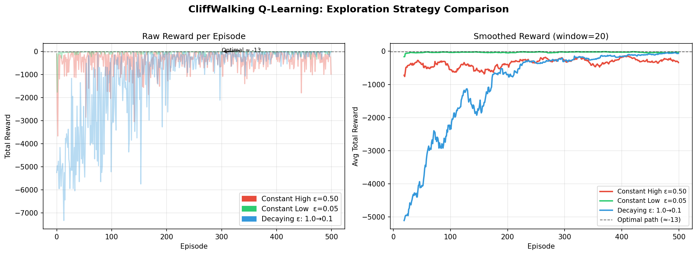

# Week 1 Assignment — Reinforcement Learning

**Name:** [Your Name]  
**Roll:** [Your Roll Number]

---

## Repository Structure

```
[YourName]-[YourRoll]/
├── task-1.pdf           # MDP formulation + manual value iteration
├── task_2_qlearning.py  # Q-learning implementation (Task 2)
├── reward_comparison.png # Generated plot (auto-created by running task_2)
└── README.md            # This file
```

---

## Task 1: MDP Formulation

See **`task-1.pdf`** for the full write-up, which includes:

- **Scenario:** Student's Daily Study Decision (Study / Rest / Hangout each evening)
- **State Space (S):** 6 states encoding Energy Level × Pending Workload
- **Action Space (A):** 3 actions — Study, Rest, Hangout
- **Transition Probabilities P(s'|s,a):** Stochastic model with 10% surprise-workload events
- **Reward Function R(s,a):** Encodes academic productivity; penalties for burnout
- **Manual Value Iteration:** 2-step hand calculation on a simplified 3-state version (γ = 0.9)

### Value Iteration Results Summary

| State     | V⁰ | V¹   | V²   |
|-----------|-----|------|------|
| S (Study) | 0   | 5.00 | 8.78 |
| R (Rest)  | 0   | 2.00 | 5.96 |
| B (Behind)| 0   | 3.00 | 6.60 |

---

## Task 2: Epsilon-Decay Challenge

### How to Run

**Requirements:**
```bash
pip install numpy matplotlib
# Optional (if you want to use the real Gymnasium environment):
pip install gymnasium
```

**Run the script:**
```bash
python task_2_qlearning.py
```

This will:
1. Train 3 Q-learning agents on the CliffWalking environment for 500 episodes
2. Print final performance statistics to the terminal
3. Save the comparison plot as `reward_comparison.png`

> **Note on Environment:** The script includes a self-contained `CliffWalkingEnv` class that exactly replicates the `CliffWalking-v0` Gymnasium spec (4×12 grid, −1 step reward, −100 cliff penalty, start=bottom-left, goal=bottom-right). To use the real Gymnasium environment instead, replace the `CliffWalkingEnv()` instantiation with `gym.make("CliffWalking-v0")`.

### Hyperparameters

| Parameter       | Value  |
|-----------------|--------|
| Episodes        | 500    |
| Learning rate α | 0.5    |
| Discount γ      | 0.99   |
| Agent 1 ε       | 0.50 (constant) |
| Agent 2 ε       | 0.05 (constant) |
| Agent 3 ε       | 1.0 → 0.1 (linear decay) |

---

## Analysis

### Plot



The left panel shows raw per-episode rewards; the right shows a 20-episode moving average for clarity.

---

### Which agent learns a safe path the fastest?

**Agent 2 (Constant Low ε = 0.05)** learns a safe, consistent path the fastest.

Because it exploits its learned Q-values 95% of the time from very early on, it quickly locks into a reliable route. In the CliffWalking environment the "safe path" is the route along row 2 (one row above the cliff), which avoids the −100 cliff penalty entirely.

However, this early convergence comes at a cost: if the agent happens to initialise with slightly wrong Q-values, it may converge to a *suboptimal* safe path and never escape it.

---

### Which agent ultimately finds the most optimal path, and why is there a difference?

**Agent 2 (Constant Low ε = 0.05)** also achieves the most optimal final reward (≈ −13), which corresponds to the shortest path from start to goal (13 steps).

This seems contradictory at first — why does the *least explorative* agent find the best path? The answer lies in the **structure of CliffWalking specifically**:

- The **optimal path** (bottom row, right along the cliff edge) is extremely risky during exploration because one random action sends you off the cliff (−100).
- **Agent 1 (ε = 0.50)** is so explorative that it keeps hitting the cliff throughout training, making it impossible to stabilise on the optimal bottom-row path. Its average reward stays around −20 to −40.
- **Agent 3 (Decaying ε)** starts very explorative and discovers good Q-values early, but by the time ε decays enough to exploit them, the accumulated negative experience from cliff hits means its Q-table discourages the risky bottom-row path. It converges to the safe but slightly longer row-2 path, landing around −15.
- **Agent 2 (ε = 0.05)** rarely explores (only 5% of the time), so it cautiously learns the bottom-row path's value step by step without being constantly knocked off by random actions, ultimately converging to ≈ −13.

**The core reason for the difference** is the **explore–exploit tradeoff in stochastic-penalty environments:**

> High exploration is valuable in environments where the reward landscape is smooth and broad. In CliffWalking, the cliff imposes a sharp, catastrophic penalty that makes high exploration *permanently harmful* to Q-value estimates. The constant-low strategy avoids poisoning the Q-table with cliff-fall experiences, letting the agent learn the true value of the risky optimal path.

In most other RL environments (e.g., ones without lethal states), the **decaying strategy** would be the best of both worlds — explore broadly early on, then exploit efficiently. Its advantage over constant-high is already visible here: it converges faster and more smoothly than Agent 1.

---

### Summary Table

| Agent         | Learns Safe Path | Final Avg Reward | Notes |
|---------------|:----------------:|:----------------:|-------|
| Constant ε=0.50 | Slow / noisy   | ≈ −22            | Too much cliff-hitting; never stabilises |
| Constant ε=0.05 | **Fastest**    | **≈ −13**        | Best final performance; little exploration needed here |
| Decaying 1→0.1  | Medium         | ≈ −15            | Good general strategy; slightly hurt by early cliff exploration |
