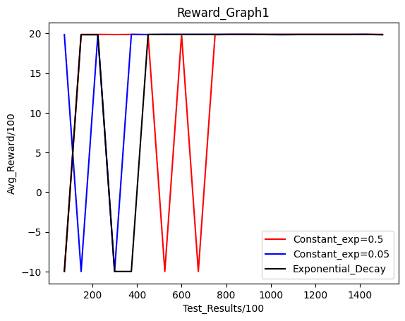
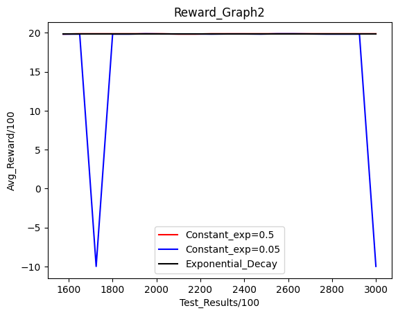
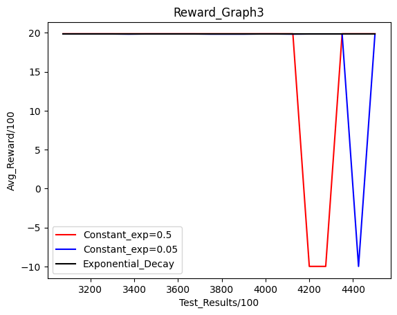
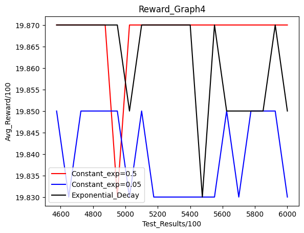

The way I have set this up is by creating an agent which separately contains a train and test method , the evaluation is soley form the test(only exploitation) which is conducted routinely after a number of training steps.  

Black=Exponential decay model, Red = 0.5 Exploration, Blue =0.05 Exploration

The Results obtained on comparing the three models was interesting and not strainght forward(I conclude this not only from the grpahs I currently show but also the many other times I iterated the models)

If we only look at the first graph it seems as if blue finds a safe path the fastest followed quickly by black and a little later by red, but as black stays with picking its path , blue fluctuates(and in some other iterations it was unable to find a safe path until much later),red also does but comparetively less(usually having no fluctuations in other iterations).

And in the final graph we see that after all 3 have stabilized red is consistenly at the top having found the best safe route , while black has found 2 routes between which it oscillates (namely the best and second best), but blue doesn't reach the best path and only oscillates between the second and third best ones.

This is exactly what was to be expected as a model with 0.5 exploration would be unable to explore areas closer to the goal preferably as majority(or half) of their actions are random,but it is also expected that given enough time they would be able to properly map and find the optimum route,wheras a constant exploration of 0.05 might be able to make quick and steady progress and find a safe path early on , it will not be able to stray away from its first path due to low exploration tendency,whereas black balances the two aspects and finds a semi optimal solution(oscillating between best and second best) while also finding it relatively quickly.

