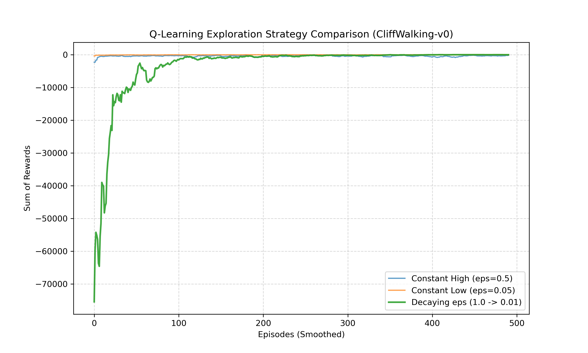

# Week 1 Assignment: MDP Formulation & The Epsilon-Decay Challenge

**Name:** Adrija Baisya  
**Roll Number:** 250074  

---

## 📝 Part 1: Formulating a Daily Scenario as an MDP

> 💡 **Note for Grading:** The formal definitions, state diagrams, and step-by-step Value Iteration manual calculations have been completed by hand and submitted in this folder as `task_1.pdf` per the assignment instructions. Below is a quick summary of the model design.

### Quick Summary of my MDP Design
I chose to model a simple daily scenario that every college student deals with: trying to balance studying, getting enough sleep, and having a social life. 

* **States ($S$):** I broke my world down into three main conditions: **Exhausted** (low energy, falling behind), **Prepared** (alert, on top of coursework), and **Socially Active** (high energy, hanging out with friends but neglecting deadlines).
* **Actions ($A$):** At any point, the student can choose to **Study**, **Sleep**, or **Hang Out**.
* **Transitions & Rewards:** The transitions map out how these choices affect your state (e.g., sleeping when exhausted transitions you to prepared with a positive reward of $+5$). On the flip side, trying to pull a heavy study session right after being out with friends causes immediate mental fatigue, leading to an exhausted state and a negative reward of $-2$.

Using these parameters, I performed exactly two steps of Value Iteration by hand assuming a discount factor of $\gamma = 0.9$. The complete manual iterations and final state values are written out clearly in the attached PDF.

---


## 🕹️ Part 2: The Epsilon-Decay Challenge (`CliffWalking-v0`)

### 📈 Strategy Comparison Plot
Below is the smoothed training curve reflecting performance across 500 episodes using different exploration parameters:



### 🔬 Empirical Analysis

#### 1. Which agent learns a safe path the fastest?
The **Constant Low ($\epsilon=0.05$)** and **Constant High ($\epsilon=0.5$)** agents exhibit highly accelerated upward trajectories in the earliest episodes. Because the Constant Low agent rarely explores random variations, it quickly clings to the very first baseline, non-cliff path it happens to accidentally uncover. 

Conversely, the **Decaying $\epsilon$** agent starts at $\epsilon=1.0$ (100% exploration). It intentionally flings itself into the cliff boundary hundreds of times early on to gather complete structural knowledge of the environment, causing its reward curve to start deep at $-75,000$ before skyrocketing upward near episode 50 once the exploration threshold drops.

#### 2. Which agent ultimately finds the most optimal path, and why?
The **Decaying $\epsilon$ Agent** ultimately discovers and stabilizes along the most optimal path. 
The core reasons behind the performance gaps are:
* **Constant High ($\epsilon=0.5$):** While it gains a strong environmental layout swiftly, it continues to take random exploratory choices 50% of the time *even after learning the optimal path*. This leads it to constantly step off the cliff edge by pure accident, keeping its episodic rewards locked at a permanently lower baseline.
* **Constant Low ($\epsilon=0.05$):** This agent suffers from premature convergence. Because it does not explore aggressively, it settled on a longer, highly sub-optimal "extra safe" path far away from the cliff edge and missed the shorter, mathematically optimal path right alongside the danger zone.
* **Decaying $\epsilon$ ($1.0 \to 0.01$):** This represents the ideal Exploration-Exploitation trade-off. It spends its early phases comprehensively mapping out the grid borders, and then systematically scales down its exploration. By the end of training, it exploits its perfect knowledge with an ultra-low exploration rate ($\epsilon=0.01$), smoothly walking the optimal path without blundering off the edge.

---

## 💻 Instructions to Run the Code

This project utilizes the **Anaconda Python Distribution** to isolate mathematical and reinforcement learning packages from conflicting native system tools.

### 1. System Requirements
Make sure Anaconda or Miniconda is installed on your computer.

### 2. Execution Steps
Open your terminal window and navigate into this project directory using literal path settings:

```bash
# Navigate to the assignment directory
cd -LiteralPath "C:\Users\adrij\Desktop\Work\Not acads winter projects 25-26\BCS\SUmmer Project year 26\week 1\week 1-[adrija baisya]-[250074]"

# Ensure dependencies are installed in your active conda environment
pip install gymnasium numpy matplotlib

# Execute the simulation script
python task_2_agent.py