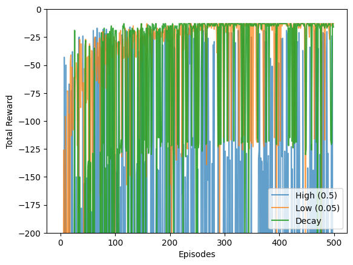

## Task 2 Analysis

**1. Which agent learns a safe path the fastest?**
Constant low exploration agent (0.05) learns a safe path the fastest.

**2. Which one ultimately finds the most optimal path, and why is there a difference?**
The decay agent finds the most optimal path. Because,
*   **Constant High (0.5):** It takes too many random steps, so the rewards stay low.
*   **Constant Low (0.05):** It stops exploring too early. It finds a safe path but gets stuck there and never finds the shorter path.
*   **Decaying:** It gets the best of both. The high starting epsilon lets it explore enough to find the true shortest path. Then, as epsilon decays, it stops acting randomly and safely uses that optimal path without falling off.
