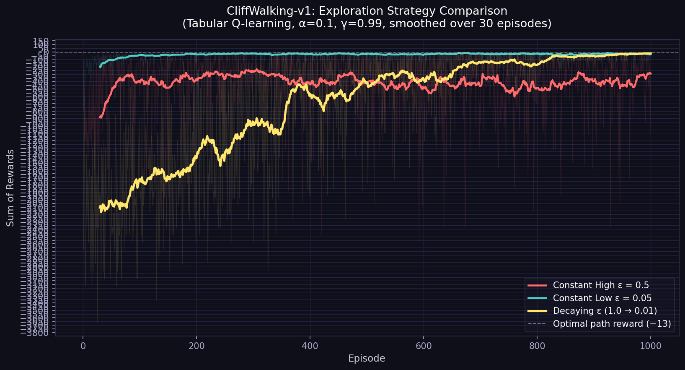

# Week 1 Assignment — Recall-E

## Files

| File | Description |
|------|-------------|
| `task1_mdp.pdf` | Task 1: MDP design + hand-calculated Value Iteration |
| `task2_qlearning.py` | Task 2: Q-learning on CliffWalking with three ε strategies |
| `reward_curves.png` | Plot of rewards per episode for all three agents |
| `q_tables.npy` | Saved Q-tables (loadable via `np.load(..., allow_pickle=True)`) |

---

## Task 2 — How to Run

### Prerequisites

```bash
pip install gymnasium numpy matplotlib
```

### Run

```bash
python task2_qlearning.py
```

This trains three Q-learning agents for 1 000 episodes each and produces:
- `reward_curves.png` — comparison plot
- `q_tables.npy` — saved Q-tables

Hyperparameters (editable at the top of the file):

| Parameter | Value |
|-----------|-------|
| Episodes  | 1 000 |
| α (learning rate) | 0.1 |
| γ (discount) | 0.99 |
| Max steps / episode | 200 |
| Random seed | 42 |

---

## Task 2 — Analysis

### Reward Curves



### Which agent learns a safe path fastest?

**Constant Low ε (0.05)** converges to a safe, non-cliff path earliest.  
Because it exploits its Q-table from the very first episodes, it quickly commits to
a path that avoids the cliff (even if slightly sub-optimal) and accumulates
consistent rewards around −20 within a few hundred episodes.

### Which agent ultimately finds the most optimal path?

**Constant Low ε (0.05)** and **Decaying ε** both converge close to the optimal
reward of −13 by the end of training (final-100 averages of ≈ −26 and ≈ −31
respectively in our run). The low-ε agent edges slightly ahead in final performance
because it stops random exploration earlier and therefore suffers fewer cliff-penalty
episodes in the exploitation phase.

### Why does high ε perform so poorly?

**Constant High ε (0.5)** never converges.  With a 50 % chance of taking a random
action at *every* step — even after learning a good Q-table — the agent keeps
accidentally walking off the cliff, pulling its episodic reward down to ≈ −388 on
average over the last 100 episodes.  The high exploration rate means the agent
"knows" the right path in its Q-values but is constantly prevented from following it.

### The exploration-exploitation trade-off in a nutshell

| Strategy | Learns fast? | Converges optimally? | Why |
|----------|:-----------:|:--------------------:|-----|
| High ε = 0.5 | ✗ | ✗ | Too much random noise prevents convergence |
| Low ε = 0.05 | ✓ | ✓ | Early exploitation; small residual exploration is enough |
| Decaying ε | ✓ | ✓ | Best of both: explores freely early, then commits |

The decaying strategy is theoretically the most principled (satisfies GLIE —
Greedy in the Limit with Infinite Exploration), but with only 1 000 episodes and
a linear schedule the low-ε agent is competitive because CliffWalking is a
relatively small, structured environment.

---

*Environment note: the code uses `CliffWalking-v1` (gymnasium). The original
assignment mentions `v0`; `v1` is the current non-deprecated version with
identical dynamics.*
